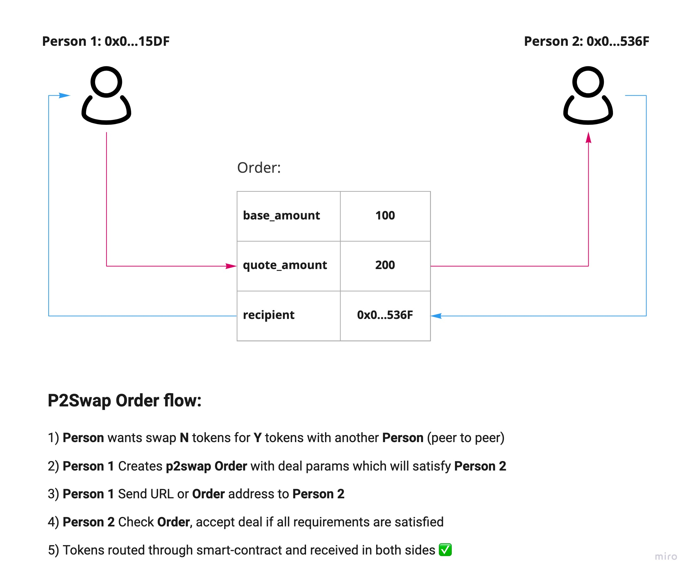

# p2swap-protocol

## Overview:
Peer to peer, decentralized protocol which allow direct swaps between 2 network participants for custom tokens without liquidity pools on Solana blockchain.

## Usage:
To perform swap, deal initiator (funder) must create `Order`, that associated with another participant. This can be done through `CLI` or `UI`. `Order` will track all required information on-chain and provide ability to securely exchange assets.
While `Order` creation, funder can set custom start / expire date, tokens rates or use those provided by oracles.

## Fees:
Protocol charge little % from each deal(from both sides). This amount is divided between p2swap token pool and devs. This can be changed later.

## On-chain program:
| Cluster      | Address     |
| ------------ | ----------- |
| Mainnet Beta | p2sSQ51hNP1yiQKtZ81sDzWBM6tkaS2ZtMrgnbBhE4v |
| Devnet       | p2sSQ51hNP1yiQKtZ81sDzWBM6tkaS2ZtMrgnbBhE4v |
| Testnet      | p2sSQ51hNP1yiQKtZ81sDzWBM6tkaS2ZtMrgnbBhE4v |

## Official addresses:
| Account      | Address     |
| ------------ | ----------- |
| Controller   | TBD         |

Those addresses are `official` and provided by `p2swap` team. Use others at own risk.

## Architecture graph:
